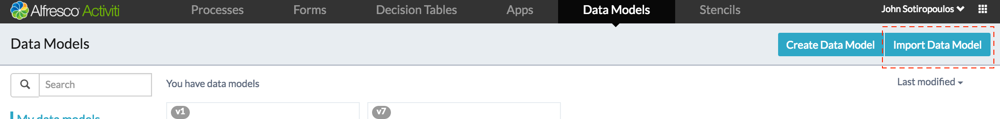
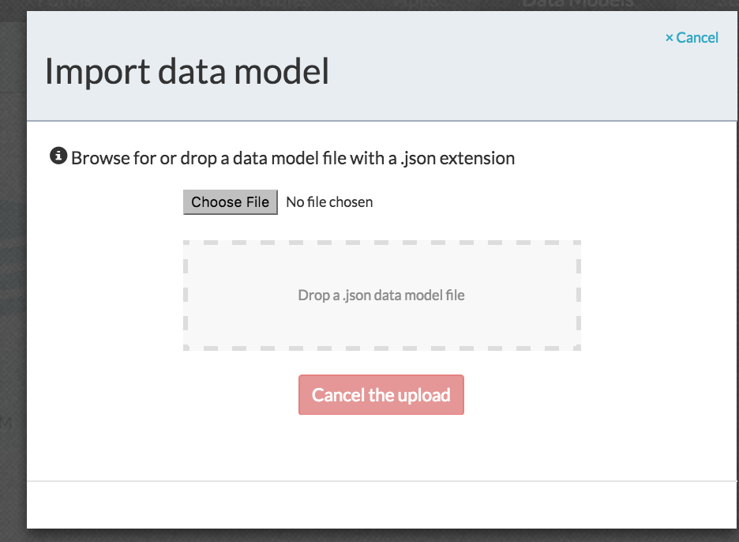
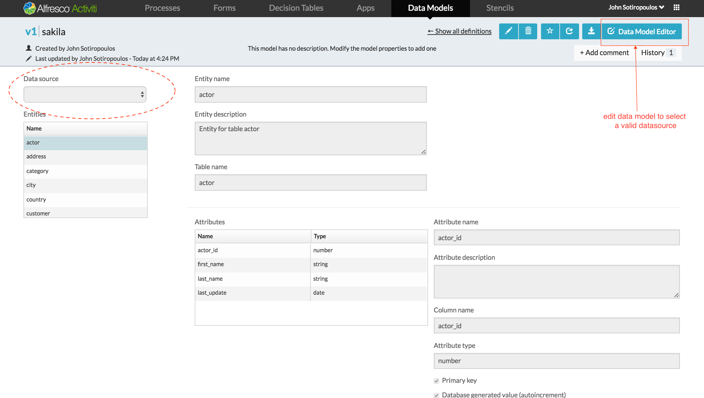
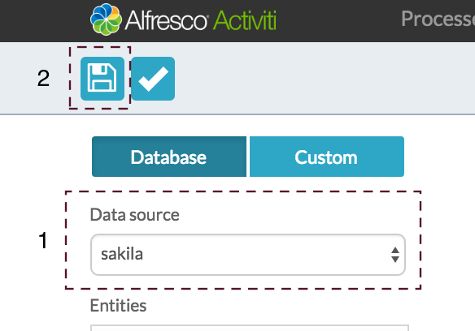
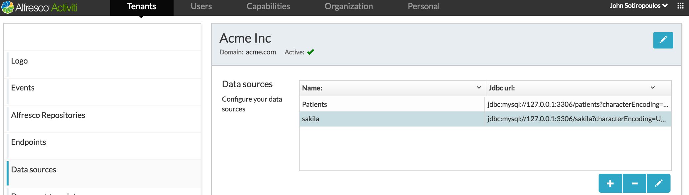

<h1 align="center">Activiti Data Model Generator CLI utility</h1>

>Utility to generate Activity BPM data models from RDBM databases

Activiti BPM Enterprise Suite recently introduced in 1.5 the ability to map database tables as entity models that can then be bound to forms, UIs, process, expressions and updated via a Store Entity task. 

This command line utility allows you to overcome the tedious task of entering data model details. Instead it uses a jdbc connection to the source database and generates the json model to import in Activiti ES 1.5
##  How to use the ActivitiDataModelGenerator utility:
You can either get the source code and use it from your development environment 
or
[download](out/artifacts/jars/ActivitiDataModelGenerator.jar) and run the pre-compiled jar and the associated generator.properties file.
The jar file contains all dependencies, including the jdbc drivers for MySQL, Postgress, SQLLite, H2, MS SQL, Oracle. You need to adjust the sample generator.properties file to your requirements and either 
- save it to your working directory (i.e. where you execute the jar from)
- or specify it as a parameter 

```bash
java -jar <path to jar>/ActivitiDataModelGenerator.jar
 java -jar <path to jar>/ActivitiDataModelGenerator.jar <optional path>/<custom settings>.properties 
 e.g java -jar <path to jar>/ActivitiDataModelGenerator.jar ./sakila.properties 
``` 

When succesful, the utility will generate a <database name>.json file with the model definition.

## &lt;configuration&gt;.properties files

The generation of the json model is driven by properties files (with generator.properties file being the default file and unless you specify another one is expected to be in the working directory.
A config properties files allows you to specify the following properties. 

```importer.properties
driver=com.mysql.jdbc.Driver
url=jdbc:mysql://127.0.0.1:3306/sakila?characterEncoding=UTF-8
username=alfresco
password=alfresco
# Use this if the source database is MySQL, SQL lite, Postgress, H2
sql=select * from %s limit 1
# Use this if the source database is Oracle
#sql=select * from {%s} WHERE ROWNUM<=1
# Use this if the source database is MS SQL Server 
#sql=select TOP 1 * from {%s}
```

For MySQL, all you have to do is change the url to point to your database and supply the correct user name and password. For other RDBMS you need to specificy the driver class. 
The utility uses SELECT statements based on the sql template, to get metadata. 
The active one "sql=select * from %s limit 1" will work for MySQL, SQL Lite, Postgress and H2 
For Oracle, MS SQL Server comment out the one above and enable the appropriate one. 
Please ensure that the URL configures the connection to use the required database/schema.

##  Import the generated model in Activiti

Once the json file is generated, you can import it as follows:

* From the kickstarter app click on Data Models and then click *Import Data Model*



* Browse and select the generated model file and click Ok



* The data model will then be imported.For newly imported data models, the datasource will most likely be invalid. Click on the *Data Model Editor*.  


Select the datasource and then save 



* If the data source has not been created, you can always go to *(Identity Mangement)/Tenant/Data Sources*, create one and save it, and then do the previous step. 



##  Other Notes
Currently Activiti 1.5 supports 3 types String, Number, Date. All other database custom types are mapped as String to allow successful generation and import.
The generated model will also include views as well as tables


*This is NOT an officially supported Alfresco product. For any questions, enhancements, or problems please raise a github issue in this project.* 

##  Building for MS SQL Server
    
The MS SQL JDBC Driver is not available on maven repos and the project will not find the dependency. either comment out  the dependency or
1. download from https://www.microsoft.com/en-us/download/details.aspx?displaylang=en&id=11774
2. install locally  with 
```mvn install:install-file -Dfile=sqljdbc4.jar -DgroupId=com.microsoft.sqlserver -DartifactId=sqljdbc4 -Dversion=4.0 -Dpackaging=jar
```
3. rebuild
## License
[Apache 2](https://raw.githubusercontent.com/jsotiro/ActivitiDataModelGenerator/master/LICENSE)
 
